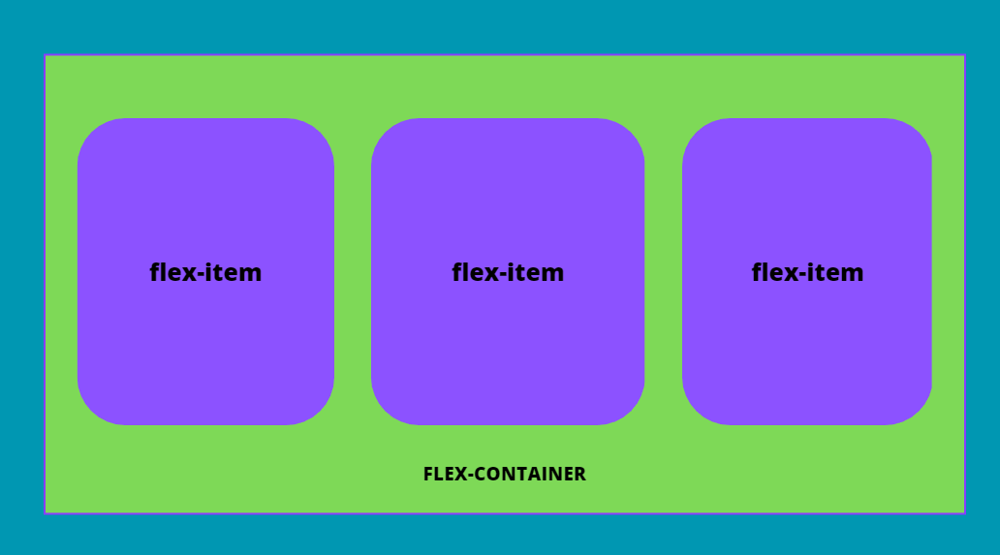
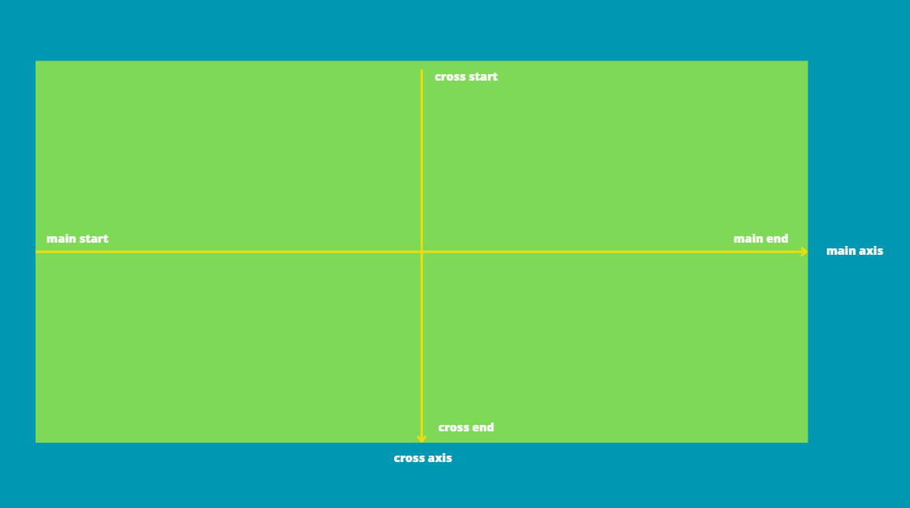

# FLEXBOX

Es un modelo de layout que permite que las cajas sean flexibles.
  - Es un valor de la propiedad display.
  - Existe display: flex y display : inline-flex para que el contenedor sea bloque o linea
    respectivamente.
  - Se necesita un contenedor (flex-container) y al menos un hijo (flex-item)
  - Las cajas flexibles son los items, el contenedor es el contexto al que pertenecen los items.

  - Existen dos ejes para colocar y alinear elementos
  - Por defecto el eje principal es horizontal y de izquierda a derecha y el eje secundario es vertical
    de arriba a abajo
  - Se pueden intercambiar los ejes y la dirección de ambos

