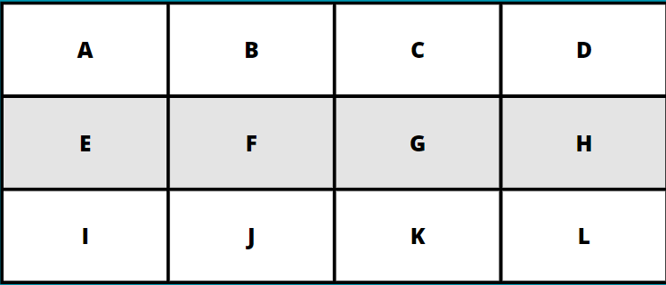
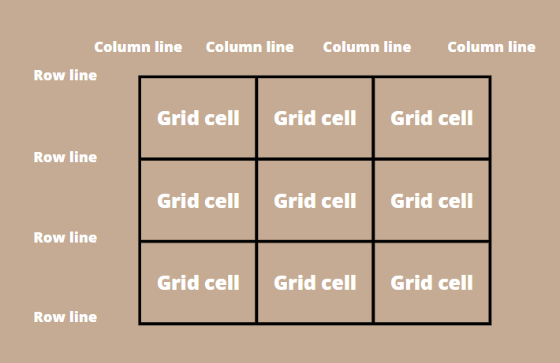
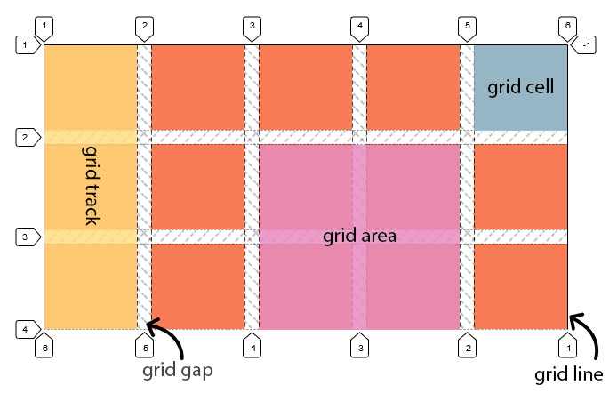

# GRID

Es un modelo de layout que permite construir grillas o cuadrículas dinámicas. Es un valor de la propiedad display.

  - Al igual que flexbox, tenemos display: grid; y display: inline-grid;
  - Se necesita un contenedor (grid-container) y al menos un hijo (grid-item)
  - Las celdas son los items, el contenedor es el contexto al que pertenecen los items.

  

  - Grid cell: Es la unidad más pequeña, es decir, es cada celda de nuestra
   cuadrícula.
  - Grid column: Es cada columna de nuestra cuadrícula.
  - Grid row: Es cada fila de nuestra cuadrícula.
  - Grid gap: Es la separación entre celdas.
  - Grid line: Existen column lines y row lines, son las líneas que delimitan cada columna/fila respectivamente.
  - Grid area: Es el área que abarca un elemento de cuadrícula.
  - Grid track: Es la unión de celdas consecutivas tanto horizontal como
  vertical. Además tiene que estar compuesto por dos o más celdas de
   cuadrícula.

  
  

  - En grid cada celda es dinámica y el resto de la cuadrícula se adpata.
  - Podemos decir donde empieza cada celda y donde acaba, tanto en columna como en fila.
  - Sus posibilidades son inmensas.

